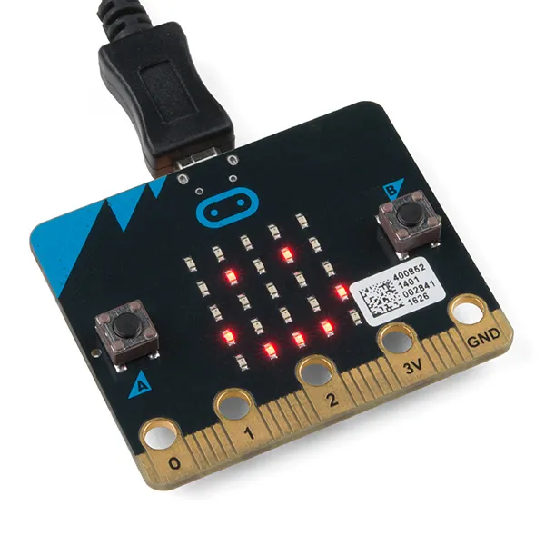

# Introduction to Micro:bits

What is a Micro:bit?

The micro:bit is a pocket-sized, programmable computer designed by the BBC to teach young people about coding and how software interacts with hardware.

Users can code using MakeCode (block-based/Scratch or programming languages like JavaScript and Python). 

You will be using this Tutors course throughout this workshop to code your Micro:bits!

# Objectives

By the end of this lab, students will be able to:
- Code the Micro:bit to different actions based on an input
- Interact between two Micro:bits
- Code a functional car

