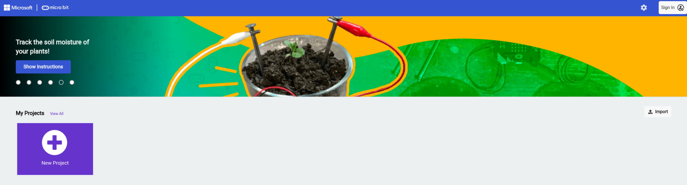
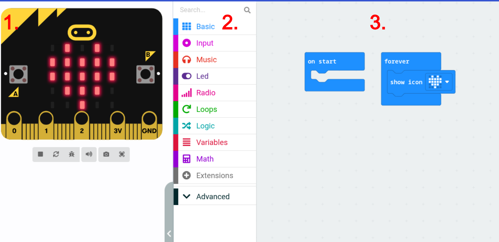

# Setting up Coding Environment

Go to the following website: [Microbit editor](https://makecode.microbit.org/)

Make a new project and name it anything you want.

An environment will open up like below.

1. This is a **virtual Micro:bit**, you can interact with the buttons and it will show what would happen on a real Micro:bit with whatever code/instructions you provide it with.
2. This is your **toolbar**. This is where your blocks of code lie that you can use to create whatever you want!
3. This is your **workspace**. This is where you join your blocks of code together (like a puzzle piece) to build your program. In this example I'm showing a heart icon forever which is displayed on the virtual Micro:bit.