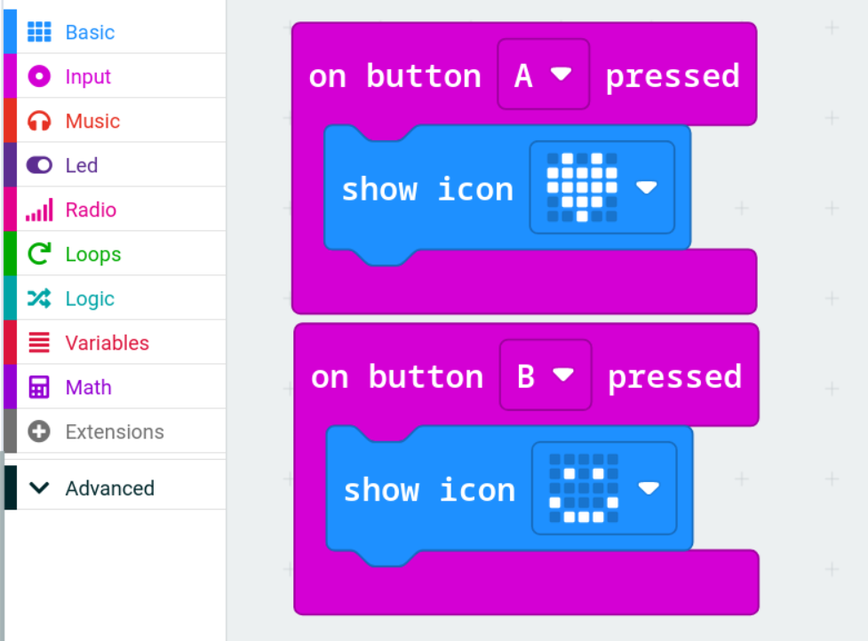
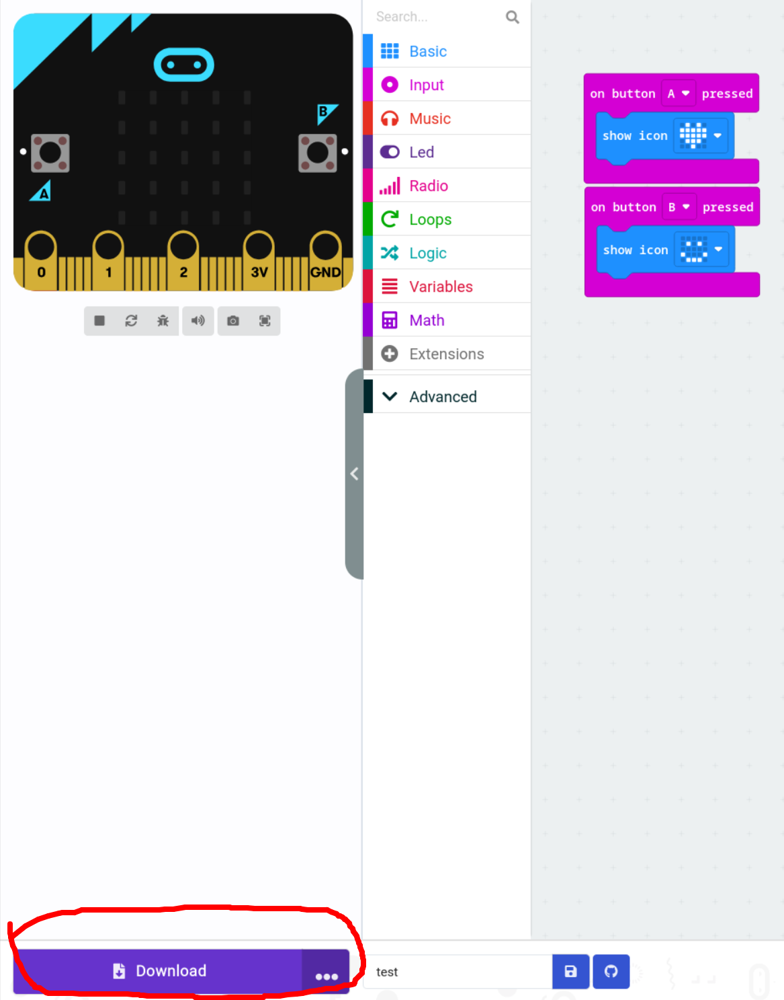
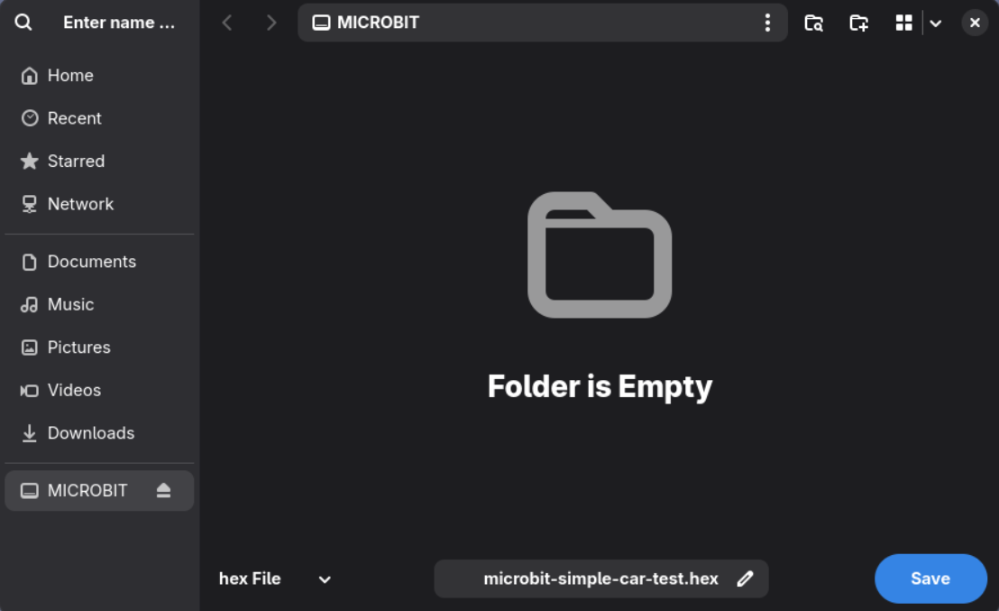

# Connecting your Micro:bit to your laptop

To load our code onto the Micro:bit we will need to connect it to our laptop by USB and do a few steps to get everything working.

### 1. Plug in the Micro:bit
Plug in the Micro:bit to the USB port of your laptop and load up a new project on the Micro:bit editor.

### 2. Make some code
For example, I have a simple example below that shows different icons based on which button you press on the Micro:bit.
These are called **On Event blocks** -> an event is something that happens when a certain input occurs.

**Note:** You may find the code works as the Micro:bit is connected to the laptop but to get it loaded on the Micro:bit without needing a cable we will need to download the code.

### 3. Download the code onto the Micro:bit
Once you have your code completed, click **Download** in the bottom left of the editor and save it on the Micro:bit. The Micro:bit will flash while it's transferring the data, `NOTE: The LED WILL FLASH TWICE, once the second flash of LED on the Micro:bit stops, you can remove the cable.`

#### Downloading the code

#### Download the .hex file onto the Micro:bit (WAIT UNTIL SECOND FLASH OF LED STOPS!)
