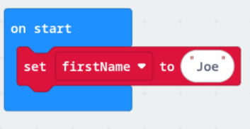
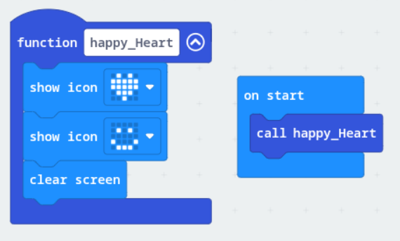

# Variables and functions
What are they?

### Variables
A variable is like a storage box with a name written on it. Inside the box, you keep a piece of information.
It allows the Micro:bit (computer) to remember things and use them later.

An example shown below is a variable called *firstName*.
In code this is how it would look like, wrapping the name Joe in quotation marks which identifies it as a string or text ("").
~~~
firstName = "Joe"
~~~

On the Micro:bit editor it looks like this:

### Functions
A function is like a saved set of instructions that can be reused. Instead of re-writing the same code over and over, it allows the Micro:bit to reuse a specific action whenever it's needed.

An example shown is a function called *happy_Heart* that executes like follows:
[Show heart icon] -> [Show smiley face] -> [Clear screen].
Everytime you **call** this function, it does all three steps automatically.

In code (e.g. Python) it would look like something like this:
~~~python
def happy_Heart():
    heart()
    smiley_face()
    clear()

happy_Heart() #Calling function
~~~
