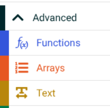
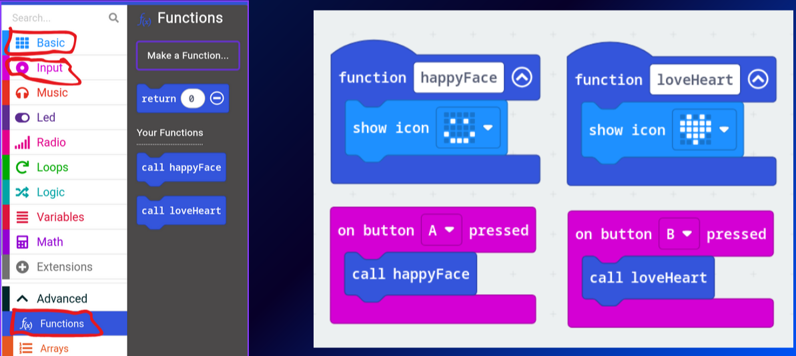
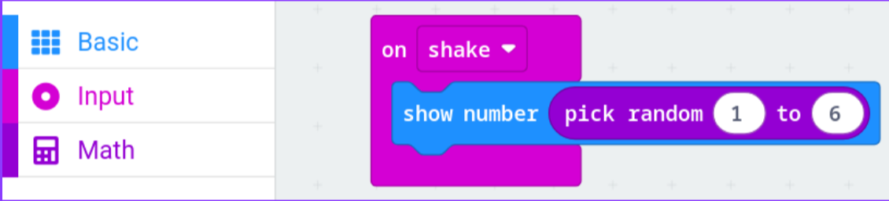

## Exercises

**Note** for functions and strings (text) it is found in the Advanced section in the toolbar:

### Exercise 1
Make a function and call it so that it shows an icon when you press A and another icon when you press B.

### Exercise 2
Make a dice roll (Create a rnadom number generator from 1-6).

Hints:
* To choose random number check Math table
* "On shake" is in **Input table**

 

Solution 1

Solution 2

