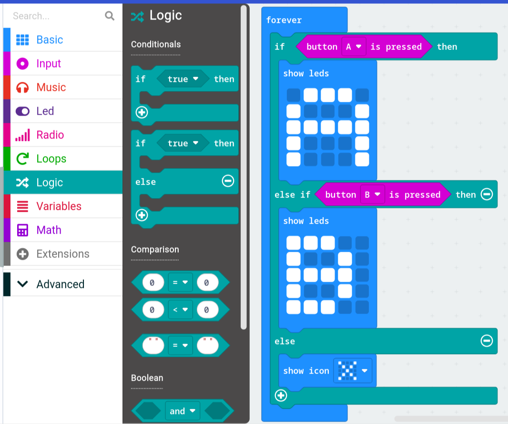

# If & Else statements

True or False?

If and Else is a way for the Micro:bit (computer) to make a decision based on conditions being true or false. (True and False values are data types called **booleans**)

We use it in real life without even thinking about it:

```python
if(raining): # (defaults to True)
    wear rain coat
else:
    wear t-shirt
```

BUT what if it's snowing?

You can add an else if statement:

```python
if(raining):
    wear rain coat
else if(snowing):
    wear winter coat
else:
    wear t-shirt  # If none of the above statements are true, just wear a t-shirt.
```

### In the Micro:bit editor
Here is how if and else statements look like in the micro:bit editor, which shows *A* on the led's if button A is pressed and so on.



