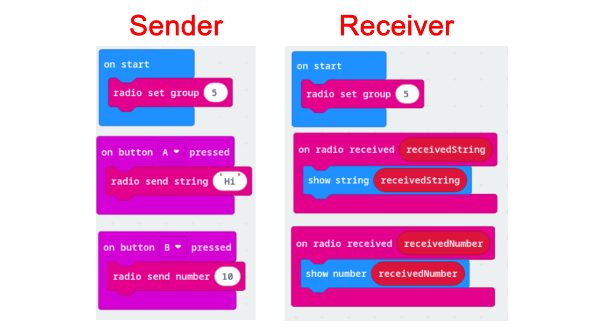

# Radio Communication

What is it?

Micro:bits can communicate wirelessly using built in radio signals. This is useful for remote controls and sending messages. We use **Radio groups** to ensure only certain micro:bits can work with each other.
 Similar to how you connect wireless headphones to your phone, your music doesn't accidentally play on the headphones of the person sitting next to you.

## Exercise

In groups of two, you will have one micro:bit as a *sender* and the other as a *receiver*.

**EVERY GROUP MUST HAVE UNIQUE RADIO GROUP NUMBERS**

### Sender
* Set a radio group and send a value based on a certain input (e.g. On button A pressed, *radio send string [value]* or *radio send number [value]* code block)

### Receiver
* Make sure you're on the **same radio group** as the sender. Receive the value from the sender.
* Once the value is received, make the Micro:bit do something! (e.g. display something on the LED)

### Example of a Sender and Receiver
In the below example, the sender is sending a string and a number based on certain inputs. The receiver Micro:bit then displays the string and Number based on which input is pressed.
