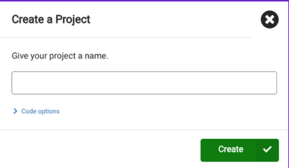
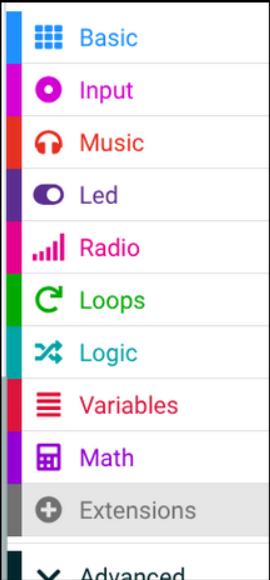
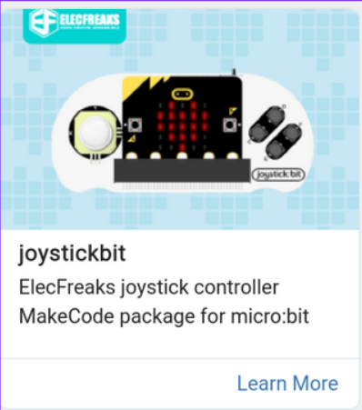

# Prerequisites

The sender

The **controller will be the sender micro:bit**, so only one member in the group codes this Micro:bit.

### Step 1
Create a new project e.g. Rc-Car-Controller

### Step 2
Go to extensions

### Step 3
Search "joystickbit" in the search box

