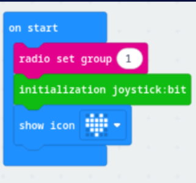
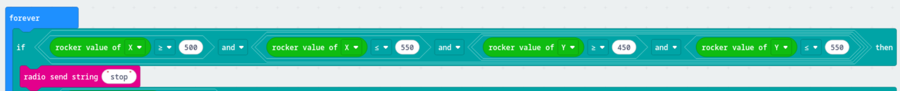
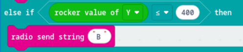
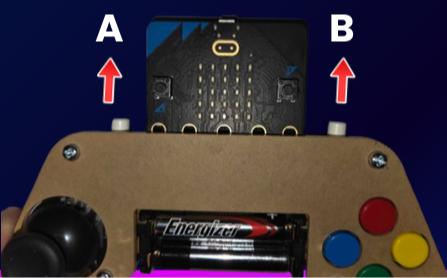

# Controller Code

## Initialising the joystick

* Set radio group (everyone has to have a **UNIQUE** radio group!)
* Initialise joystick:

* 

## Analog movement

**Note**: At rest (centre), the co-ordinates of the analog stick are:
```
X = 525 and Y = 506
```

Therefore, if you want to go left the X value must be less than 525 and if you want to reverse (go backwards), the Y value has to be less than 506 and so forth.
<br>
**Do atleast 100 less/more than the centre depending on the direction you want to go in.**
<br>

* We would advise to add a logic statement at the very top of the code block to ensure the car doesn't move if controller analog isn't moved:
    
* In a **forever block** build if and else if statements for analog movement (rocker value for X and Y) in the *Joystickbit*. **Do Forward/Reverse first!**

* Example of a logic condition for reversing (going backwards):
    

* Optional: You can add a stop aswell with the press of a button, e.g. on button A pressed *radio send string "stop"*
    
    

<br>
