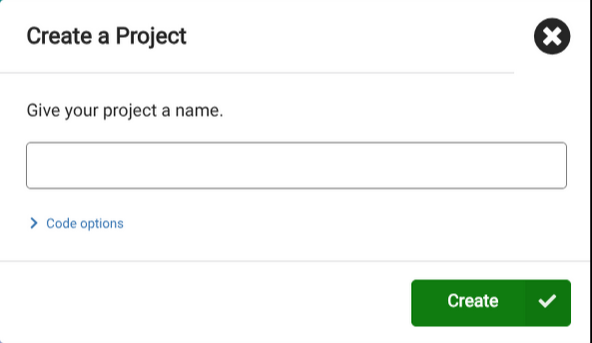
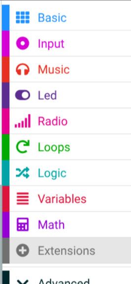
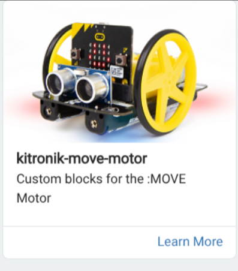

# Prerequisites

The receiver

The **car will be the receiver**, so the other member in the group will code this Micro:bit.

### Step 1
Create a new project e.g. Rc-Car-Controller

### Step 2
Go to extensions

### Step 3
Search "Move motor" in the search box 

