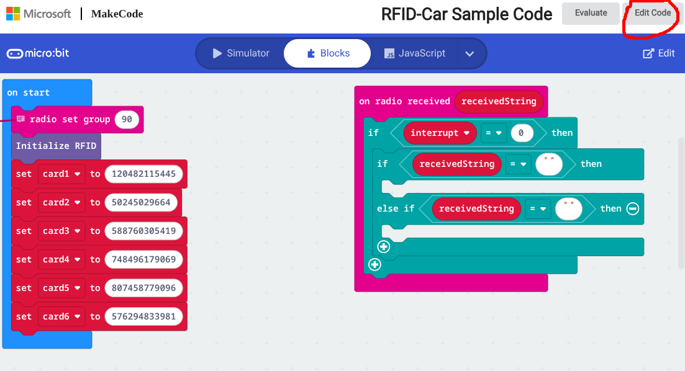
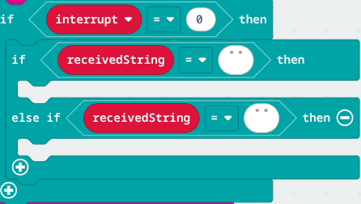

# Prerequisites

The receiver

The **car will be the receiver**, so the other member in the group will code this Micro:bit.

### Step 1
Click this [Link](https://makecode.microbit.org/S86474-15661-11541-70084) for the sample code and click "edit project"

### Step 2
Name the file Rc-car. You will be adding code to the if received blocks!

**REMEMBER TO CHANGE THE RADIO GROUP IN THE "on start" BLOCK!**

